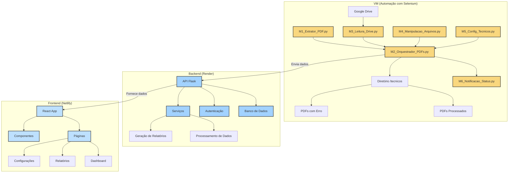

```mermaid
graph TD
    subgraph "VM (Automação com Selenium)"
        A[M1_Extrator_PDF.py] --> B[M2_Orquestrador_PDFs.py]
        C[M3_Leitura_Drive.py] --> B
        D[M4_Manipulacao_Arquivos.py] --> B
        E[M5_Config_Tecnicos.py] --> B
        B --> F[M6_Notificacao_Status.py]
        
        G[Google Drive] --> C
        B --> H[Diretório /tecnicos]
        H --> I[PDFs Processados]
        H --> J[PDFs com Erro]
    end
    
    subgraph "Backend (Render)"
        K[API Flask] --> L[Banco de Dados]
        K --> M[Autenticação]
        K --> N[Serviços]
        N --> O[Processamento de Dados]
        N --> P[Geração de Relatórios]
    end
    
    subgraph "Frontend (Netlify)"
        Q[React App] --> R[Páginas]
        Q --> S[Componentes]
        R --> T[Dashboard]
        R --> U[Relatórios]
        R --> V[Configurações]
    end
    
    B -->|Envia dados| K
    K -->|Fornece dados| Q
    
    style A fill:#f9d77e,stroke:#333,stroke-width:2px
    style B fill:#f9d77e,stroke:#333,stroke-width:2px
    style C fill:#f9d77e,stroke:#333,stroke-width:2px
    style D fill:#f9d77e,stroke:#333,stroke-width:2px
    style E fill:#f9d77e,stroke:#333,stroke-width:2px
    style F fill:#f9d77e,stroke:#333,stroke-width:2px
    
    style K fill:#a2d2ff,stroke:#333,stroke-width:2px
    style L fill:#a2d2ff,stroke:#333,stroke-width:2px
    style M fill:#a2d2ff,stroke:#333,stroke-width:2px
    style N fill:#a2d2ff,stroke:#333,stroke-width:2px
    
    style Q fill:#bde0fe,stroke:#333,stroke-width:2px
    style R fill:#bde0fe,stroke:#333,stroke-width:2px
    style S fill:#bde0fe,stroke:#333,stroke-width:2px
```
