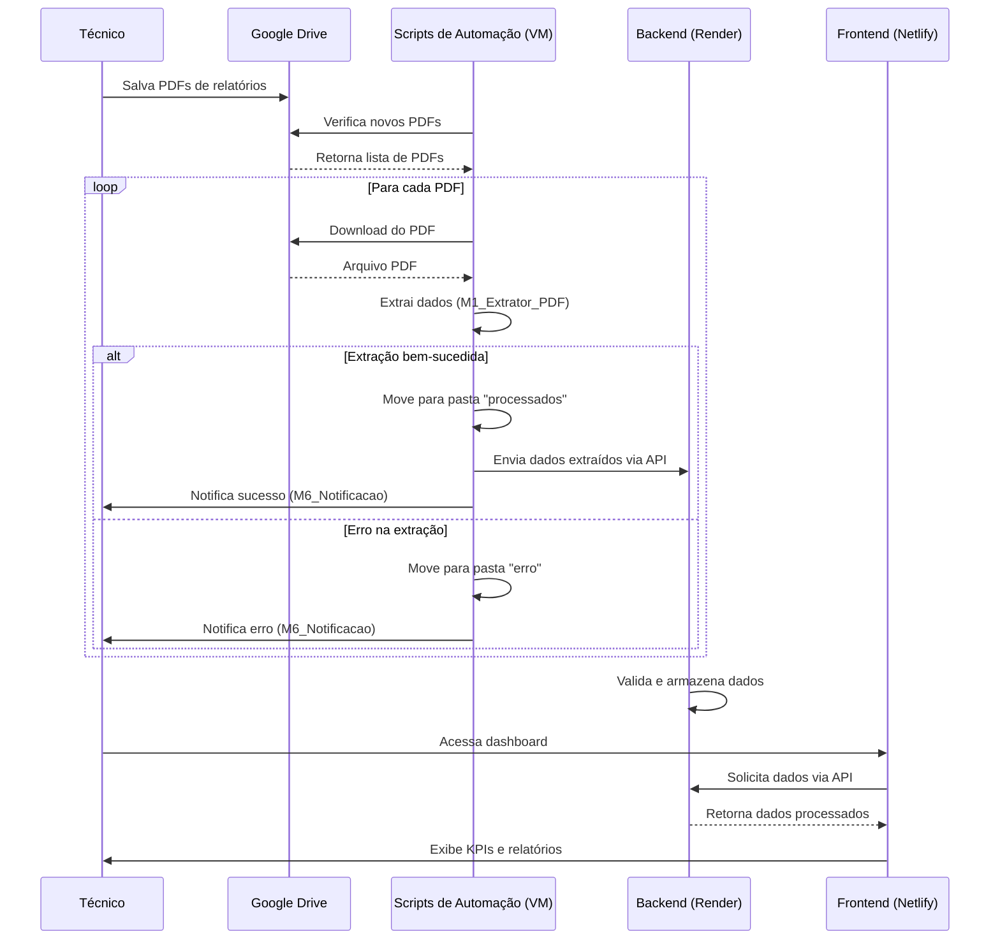

```mermaid
sequenceDiagram
    participant Técnico
    participant GDrive as Google Drive
    participant VM as Scripts de Automação (VM)
    participant Backend as Backend (Render)
    participant Frontend as Frontend (Netlify)
    
    Técnico->>GDrive: Salva PDFs de relatórios
    VM->>GDrive: Verifica novos PDFs
    GDrive-->>VM: Retorna lista de PDFs
    
    loop Para cada PDF
        VM->>GDrive: Download do PDF
        GDrive-->>VM: Arquivo PDF
        VM->>VM: Extrai dados (M1_Extrator_PDF)
        
        alt Extração bem-sucedida
            VM->>VM: Move para pasta "processados"
            VM->>Backend: Envia dados extraídos via API
            VM->>Técnico: Notifica sucesso (M6_Notificacao)
        else Erro na extração
            VM->>VM: Move para pasta "erro"
            VM->>Técnico: Notifica erro (M6_Notificacao)
        end
    end
    
    Backend->>Backend: Valida e armazena dados
    
    Técnico->>Frontend: Acessa dashboard
    Frontend->>Backend: Solicita dados via API
    Backend-->>Frontend: Retorna dados processados
    Frontend->>Técnico: Exibe KPIs e relatórios
```
